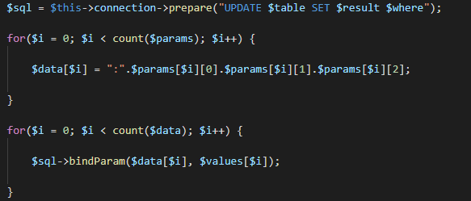

## Create, Read, Update, Delete (CRUD PHP)

> Crud desenvolvido para facilitar as consultas e inserções no banco de dados e reduzir linhas de códigos.



* Inserts, Updates, Select's, Delete's no banco de dados sem se preocupar com parâmetros de variáveis e todas suas estruturas. Esse CRUD fará todo o serviço pesado e facilitará sua vida no dia-a-dia, além de diminuir algumas linhas de código...
* `NOVIDADE` -> Métodos para manipulação de usuários!

# Atualizações:

- [x] Método **user**, **create**, **find**
- [x] Início aos métodos encadeados,
- [x] Método **deleteTable**,
- [x] Métodos **clearOne**, **clearMore**, **clearAllTable**,
- [x] Método **delete**,
- [x] Método **insert**,
- [x] Método **update**.
- [x] Metódo **selectOneOrMore** e **selectAll**,
- [x] Método para verificar a existência de tabelas
- [x] Atributo global para comunicar com o banco de dados
- [x] Conexão com o banco de dados (PHP-POO PDO)

## Exemplo de uso

#### - Iniciando

```php
$crud = new CRUD('host', 'user', 'pass', 'dbname', 'charset');
```
> **charset** não obrigatório. Como padrão: **utf8**
------------
#### - Selecionar todos os registros de uma tabela
```php
$crud->selectAll('tabela', 'where', 'order', 'limit');
```
> **order** e **limit** não obrigatório. Como padrão: **nulo**
* _Retorno_: [array]
------------
#### - Selecionar uma ou mais coluna de uma tabela
```php
$crud->selectOneOrMore('tabela', String 'colunas', 'where', 'order', 'limit');
```
> **order** e **limit** não obrigatório. Como padrão: **nulo**
* _Retorno_: [array]
------------
#### - Fazer update em uma ou mais colunas de uma tabela
```php
$crud->update('tabela', String 'coluna(s)', Array ['valor(es)'], 'where');
```
> Todos os campos são obrigatórios
* _Retornos_: (Boolean) true / (String) Erro: _errorInfo_
------------
#### - Fazer inserção em uma tabela
```php
$crud->insert('tabela', String 'parâmetro(s)', Array ['valor(es)']);
```
> Todos os campos são obrigatórios
* _Retornos_: (Boolean) true / (String) Erro: _errorInfo_
------------
#### - Deletar um registro da tabela
```php
$crud->delete('tabela', 'where');
```
> Todos os campos são obrigatórios
* _Retornos_: (Boolean) true / (String) Erro: _errorInfo_
------------
#### - Limpar o registro de uma coluna da tabela
```php
$crud->clearOne('tabela', 'coluna', 'where');
```
> Todos os campos são obrigatórios
* _Retornos_: (Boolean) true / (String) Erro: _errorInfo_
------------
#### - Limpar o registro de uma ou mais colunas da tabela.
```php
$crud->clearMore('tabela', Array ['colunas'], 'where');
```
> Todos os campos são obrigatórios
* _Retornos_: (Boolean) true / (String) Erro: _errorInfo_
------------
#### - Limpar todos os registros de uma tabela.
```php
$crud->clearAllTable('tabela');
```
> Todos os campos são obrigatórios
* _Retornos_: (Boolean) true / (String) Erro: _errorInfo_
------------
#### - Apagar uma tabela do banco.
```php
$crud->deleteTable('tabela');
```
> Todos os campos são obrigatórios
* _Retornos_: (Boolean) true / (String) Erro: _errorInfo_
------------
#### - Criar uma tabela para registro de usuários.
```php
$crud->user('nome-da-tabela');
```
> O parâmetro é opcional, por default, ele irá criar uma tabela com o nome **users**.

Isso fará o CRUD criar uma tabela com o nome desejado ou por default (users), e criará as colunas:

- id int NOT NULL auto_increment PRIMARY KEY,
- name varchar (255) NOT NULL,
- email varchar (255) NOT NULL UNIQUE,
- password varchar (255) NOT NULL,
- birthday varchar (255) NOT NULL,
- time_register timestamp DEFAULT CURRENT_TIMESTAMP,
- last_login varchar (255) NOT NULL,
- ip_register varchar (20),
- last_ip varchar (20)

> A linha de código acima não será mais necessário após usar uma vez.
Para as próximas chamadas ao método user() para criar/procurar um usuário, precisará passar como parâmetro o nome da tabela personalizada (caso você tenha criado acima),
como default o método sempre irá sempre selecionar users. Abaixo fiz sem parâmetro pois estava usando a tabela default.
------------
#### - Criar um usuário.
```php
$crud->user()->create([
    'name' => 'value (varchar)',
    'email' => 'value (varchar)',
    'password' => 'value (varchar)',
    'birthday' => 'value (date)'
]);
```
> O parâmetro em user() é opcional, como no exemplo acima. Os demais parâmetros são preenchidos automaticamente exceto **last_login**.
* _Retornos_: (Bool) true / (String) Cadastro já existente (verificado por email `chave única`): Array['dados']
------------
#### - Buscar um usuário.
```php
$crud->user()->find('id');
```
> ID para o usuário registrado.
* _Retornos_: (Array) dados / (Bool) false
------------